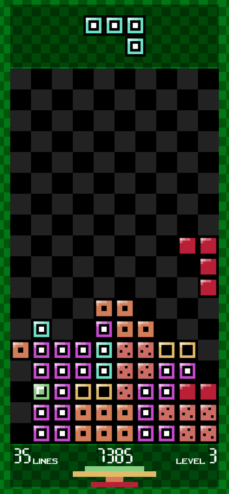
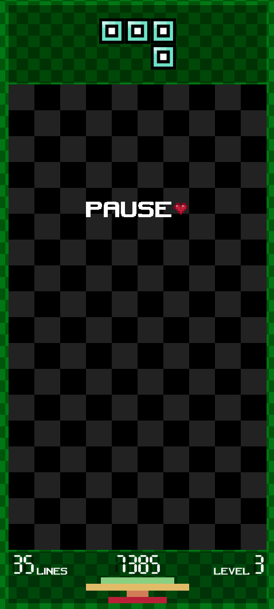
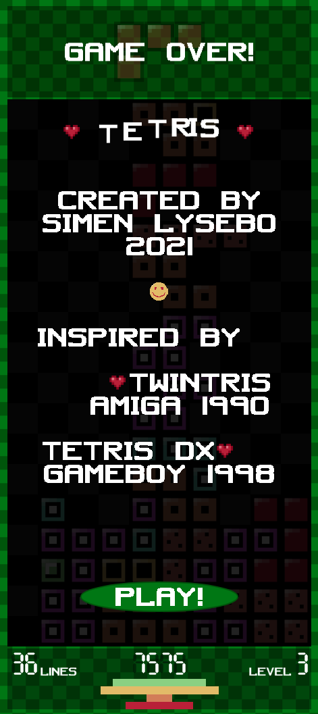
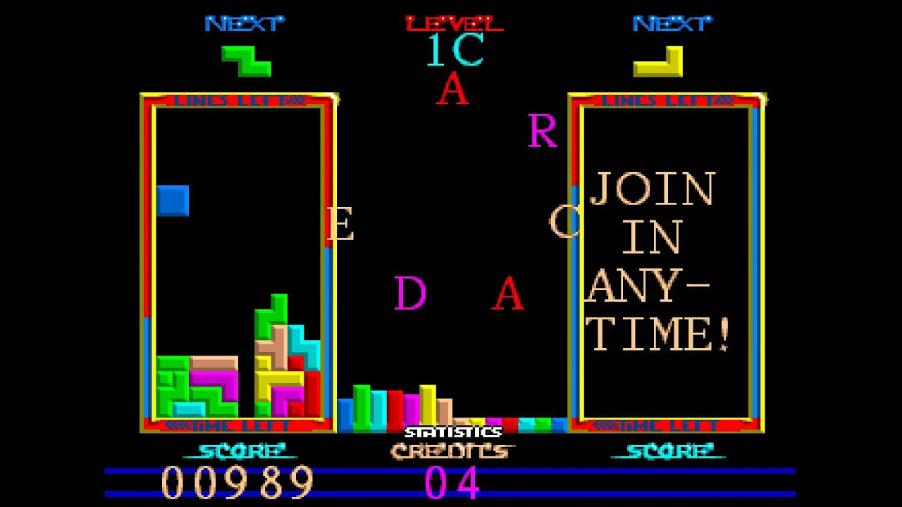
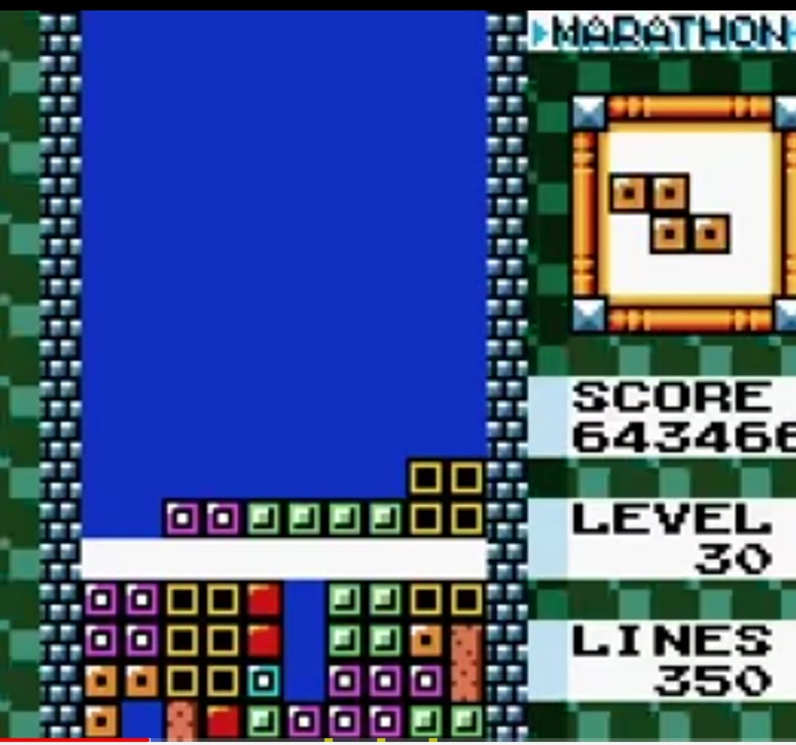

# Tetris js 2021

This is a tribute to my two favorite Tetris clones. Twintris (Amiga) and Tetris DX (Game Boy Color). I have selected the most enjoyable aspects of either version, and created a clone using HTML, CSS, SVG and JavaScript.

Enjoy!

<a href="https://lysebo.xyz/games/tetris" target="_blank">https://lysebo.xyz/games/tetris</a>

&nbsp;&nbsp;

# Controls

**Desktop:**

WASD or arrow keys

- Start: ENTER or start button on screen
- Pause: P
- Move left: A or arrow left
- Move right: D or arrow right
- Rotate counter-clockwise: I
- Rotate clockwise: O
- Speed drop: S or arrow down

(it's also possible to rotate (clockwise) with W or arrow up)

**Mobile:**

- Start: press start-button
- Pause: tap the top of the screen
- Move: swipe horizontally
- Rotate: tap left or right side of the screen
- Speed drop: press and hold the bottom of the screen

# Memory Lane

## Twintris (Amiga 500, 1990)

A classic which was even made by Norwegian developers! Everything is great about Twintris!

- Earthquake when clearing 4 lines (QUAD!)
- Pieces fall smoothly (don't snap to grid)
- Pieces fall faster for each level, up to a certain point
- Visualised statistics on the frequency of each piece
- Score
- Next piece is visible
- 10x20 board
- Possible to move/rotate a piece for a short time after landing
- Speed drop
- 2 player mode
- Multiple controls options (keyboard, joystick)
- Excellent music and sound effects
- Demo scene feeling

  

## Tetris DX (Game Boy Color, 1998)

Maximum Tetris experience due to a hand-held device with physical buttons. I bought the GBC solely for Tetris DX. This has a more vintage look & feel, but it's still tip-notch.

- Pieces fall faster for each level (up to level 10)
- The board has a different background color depending on level
- 10x18 board
- Next piece is visible
- Score
- Line counter
- New level for every 10 lines
- Pieces "fall" one line at a time
- Compact design
- Possible to move/rotate a piece for a short time after landing
- Speed drop
- Nice animation around the board
- The animation changes color and speeds up briefly when 4 lines are cleared
- The game can be paused and resumed, even after a power off

Cute detail: The score is represented with max 7 digits. One of my goals back in the day was to find out what would happen when I got more than 9999999 points. Would the game crash? Would it start from zero? After years of playing (and thanks to the pause function) I got the answer. The score stops at 9999999 even if the game continues.

# Tribute-version

## Specs:

- Playable on both mobile and desktop
- Controlled by keyboard or touch events
- Compact design, utilises as much of the screen as possible
- Layout inspired by Amiga
- Pieces inspired by GBC
- 10x18 board
- Stats: score, lines, level
- Stats on how many lines are cleared at a time (1, 2, 3 or 4)
- Identical score calculations as GBC
- Implemented the 7 digit score limit from GBC <3
- More or less the same piece randomizer algorithm as GBC, with a slight preference for a certain piece.
- Speed drop
- Pause hides the board, preventing cheating
- Next piece is visible
- Rotating both clockwise and counter-clockwise
- Sideways movement snaps to grid
- Downwards movement is smooth
- Higher level means increased speed (up to level 10)
- Pieces float briefly after landing, making it possible to move and rotate
- Possible to move a piece sideways into an empty slot
- If rotation is not possible at the current location, the game attempts to nudge the piece 1-2 squares to either side. This is a gamer friendly aspect of both the Amiga and GBC version.
- Cleared lines flashes to white before collapsing
- 4 lines cleared results in the legendary QUAD animation from the Amiga version
- 3 and 2 lines leads to smaller earthquakes (because the QUAD was so fun to implement)
- Animated grid around the board, inspired by GBC but also secretly worshiping the Amiga
- Custom charset (PNG and SVG) on all text and numbers
- Intro screen with info and greetings

## Technology

HTML was chosen over canvas as this gives me a lot of mechanisms for free, including event handlers, screen updating, element positioning/stacking/flowing, and of course CSS with animations and transitions (and related end event handlers).

I have my own build system created with node/gulp, which lets me organise the code in folders and separate files for convenience. The build process compiles SCSS and modern JS. The end result is one single HTML file with CSS and JS compressed and inlined.

I'm also using my own mini framework for DOM manipulation in JS. Inspired by jQuery, but consisting of a selected few functions that I need.

Pieces are constructed with SVG.  
Numbers in stats section are SVGs  
Charset (PNG) is made with The GIMP :-D

No 3rd party frameworks are used, because I want to get a grasp of all the details and handle all the aspects involved in developing a game.

This game was made in my spare time, between January and April 2021.

Simen Lysebo

## How was &lt;insert subject&gt; implemented?

Please have a look at the code! I might write some articles about certain aspects in the future. I also might not.
